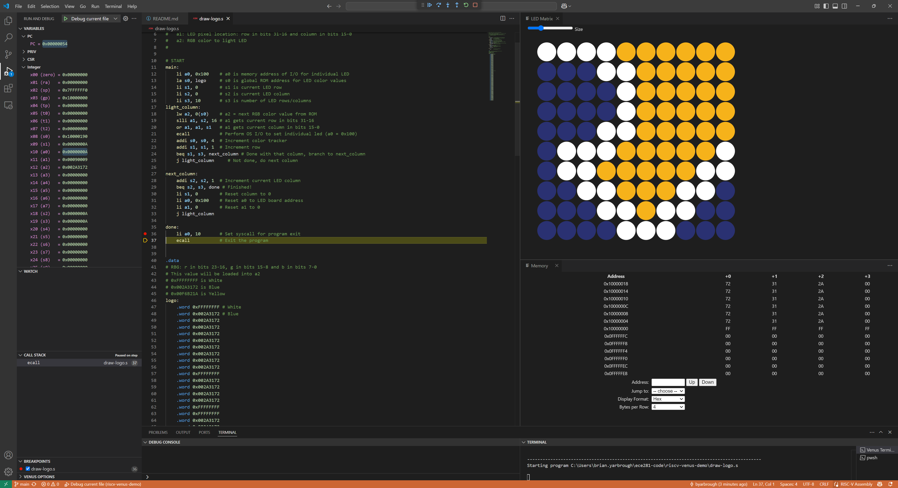

# RISC-V VS Code Venus Demo

Draw the RISC-V Logo with the [VS Code Venus Simulator](https://marketplace.visualstudio.com/items?itemName=hm.riscv-venus) LED Matrix.

Simply clone, open in VS Code, install the recommended plugins
(`hm.riscv-venus` and `zhwu95.riscv`), then run and debug!

If the LED Matrix doesn't automatically open, use **Ctrl+Shift+P** then
`Venus: Open LED Matrix`.

## Documentation

- The example code is from [the ledmatrix example](https://github.com/hm-riscv/vscode-riscv-venus/tree/main/examples/ledmatrix).
- Comments were added based off [VS Code RISC-V Venus README](https://github.com/hm-riscv/vscode-riscv-venus?tab=readme-ov-file#led-matrix).
